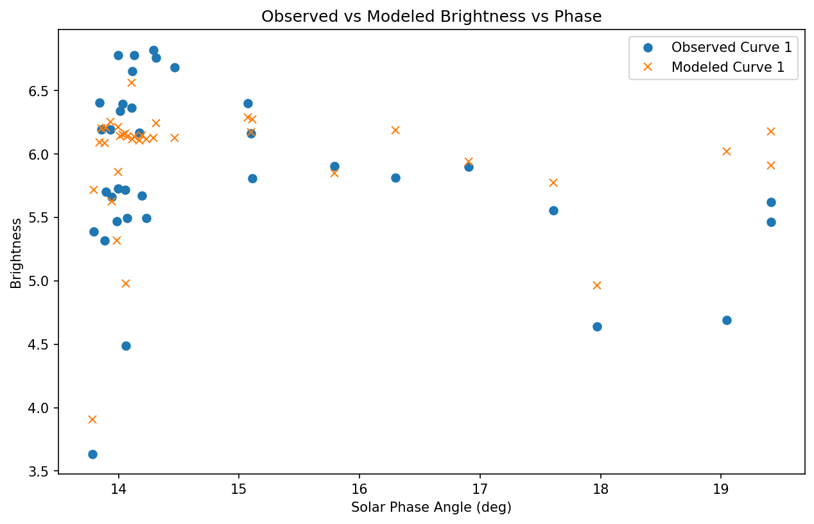
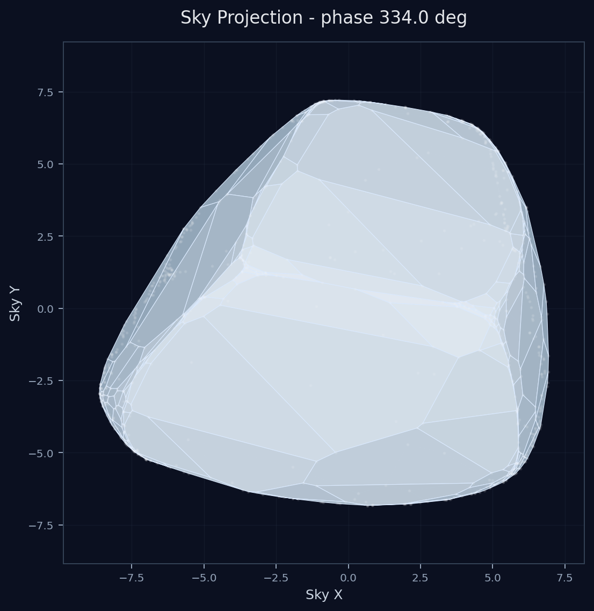
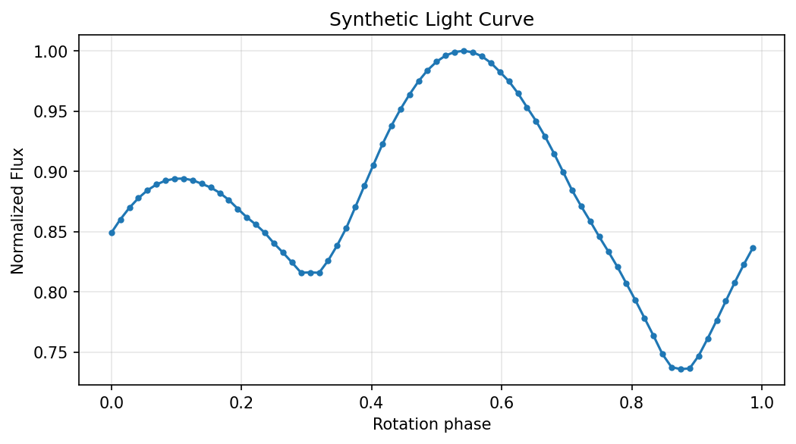
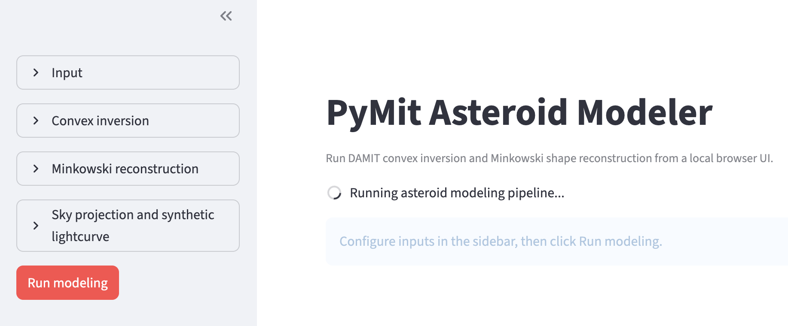

# Asteroid Modeling Python Module Documentation

## Overview
The `asteroid_modeling.py` module provides a Python orchestration layer to automate the inversion of asteroid light curves into 3D convex shape models. It wraps two established numerical codes:
1.  **convexinv (C)**: Computes the Gaussian image of the asteroid (face areas and normals) from observed light curves.
2.  **minkowski (Fortran)**: Reconstructs the 3D vertices and polygonal faces from the areas and normals using Minkowski's theorem.

The package also provides plotting helpers, interactive Plotly output, sky projection products, synthetic lightcurves, and a local Streamlit GUI for running the workflow from a browser.

## Prerequisites
To use this module, you must have the following installed:
-   `numpy`
-   `pandas` (for DataFrame lightcurve support)
-   `matplotlib`
-   `plotly` (for interactive 3D rendering)
-   `requests` (for DAMIT URL downloads)
-   `streamlit` (for the local GUI)
-   Compiled executables for `convexinv` and `minkowski` in the `damit` folder. 

- The source code for DAMIT can be downloaded from: [https://damit.cuni.cz/projects/damit/files/version_0.2.1.tar.gz](https://damit.cuni.cz/projects/damit/files/version_0.2.1.tar.gz).

You can install the Python dependencies via pip:
```bash
pip install numpy pandas matplotlib plotly requests streamlit
```

### Quick Links
-   [**Getting Started Guide**](docs/getting_started.md): A step-by-step tutorial on setting up your environment, formatting lightcurves, and running your first inversion.
-   [**API Reference**](docs/api_reference.md): Complete documentation of functions, `inversion_options`, and output parameters.
-   [**Scientific Explanation**](docs/inversion_method.md): A detailed overview of the mathematical theories and inversion techniques driving the module.

## Quick Start Example

If you already have your data prepared and compiled the executables, here's a minimal example:

```python
import pymit

# Instantiate the modeler
modeler = pymit.AsteroidModeler(asteroid_name="A7753", output_dir="data")

# Load a CSV, native DAMIT/convexinv text file, or DAMIT plaintext URL
modeler.load_lightcurves(
    "https://damit.cuni.cz/projects/damit/LightCurves/"
    "exportAllForAsteroid/7753/plaintext/A7753.lc.txt"
)

# Configure inversion parameters
inv_config = {
    "initial_lambda": 269.0,
    "initial_lambda_fixed": 1,
    "initial_beta": 62.0,
    "initial_beta_fixed": 1,
    "initial_period": 33.0,
    "initial_period_fixed": 1,
    "phase_func_c": 0.1,
    "phase_func_c_fixed": 0,
    "phase_func_a": 0.5,
    "phase_func_a_fixed": 0,
    "phase_func_d": 0.1,
    "phase_func_d_fixed": 0,
    "phase_func_k": -1.05,
    "phase_func_k_fixed": 0,
}
conj_config = {
    "number_of_iterations": 100
}
modeler.load_parameters(inversion_json=inv_config, conjgradinv_json=conj_config)

# Run inversion
vertices, faces = modeler.run_inversion()

# Plot and export results
modeler.plot_lightcurves_results(save=True, show=False, max_curves=3)
modeler.plot_model(save=True, show=False)
modeler.plot_model_plotly(save=True, show=False)
modeler.plot_sky_projection(save=True, show=False, jd=2461169.0)
modeler.plot_synthetic_lightcurve(save=True, show=False, jd=2461169.0)
modeler.export_obj()

print(f"Generated an asteroid model with {len(vertices)} vertices and {len(faces)} faces.")
```

**Modeled output examples:**




## Local Streamlit GUI

Run the browser GUI from the repository root:

```bash
PYTHONPATH=src streamlit run apps/streamlit_app.py
```



The GUI supports:
-   DAMIT plaintext lightcurve URLs
-   Uploaded CSV or native DAMIT/`convexinv` lightcurve files
-   Convex inversion, LSL scattering, and Minkowski reconstruction controls
-   Sky projection and synthetic lightcurve generation for a selected Julian date
-   Interactive 3D model display and download buttons for generated outputs

Sidebar values are saved to `.pymit_last_params.json` after a successful run and restored on the next GUI start.

## Error Handling
The module raises `AsteroidModelError` if the underlying C/Fortran binaries fail or return a non-zero exit code. Ensure that your input parametrization matches the formatting expectations of the Kaasalainen & Torppa inversion codes.

## Licensing and Citations

The `damit` components used by this module are derived from the [Database of Asteroid Models from Inversion Techniques (DAMIT)](https://damit.cuni.cz/projects/damit/). 

Except where otherwise stated by the authors, content is licensed under a [Creative Commons Attribution 4.0 International License](https://creativecommons.org/licenses/by/4.0/). 

**If you use this module and its underlying DAMIT executables for research, please abide by the project's rules:**

1.  **Always cite the original paper where a given model was published.** Give credit to those who derived the models you are using.
2.  Also, cite the core project paper:
    > *Ďurech et al. (2010), DAMIT: a database of asteroid models*, A&A, 513, A46
    > (ADS: [2010A&A...513A..46D](https://ui.adsabs.harvard.edu/abs/2010A%26A...513A..46D))
3.  Provide a link back to the DAMIT website: `https://damit.cuni.cz/projects/damit/`

For non-scientific work, simply providing a link to the website above is sufficient.
