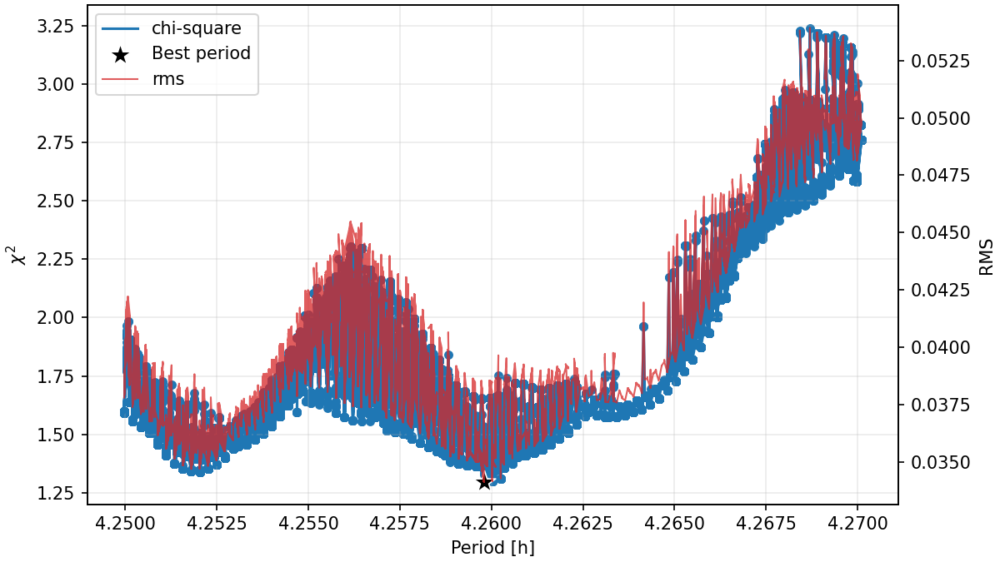
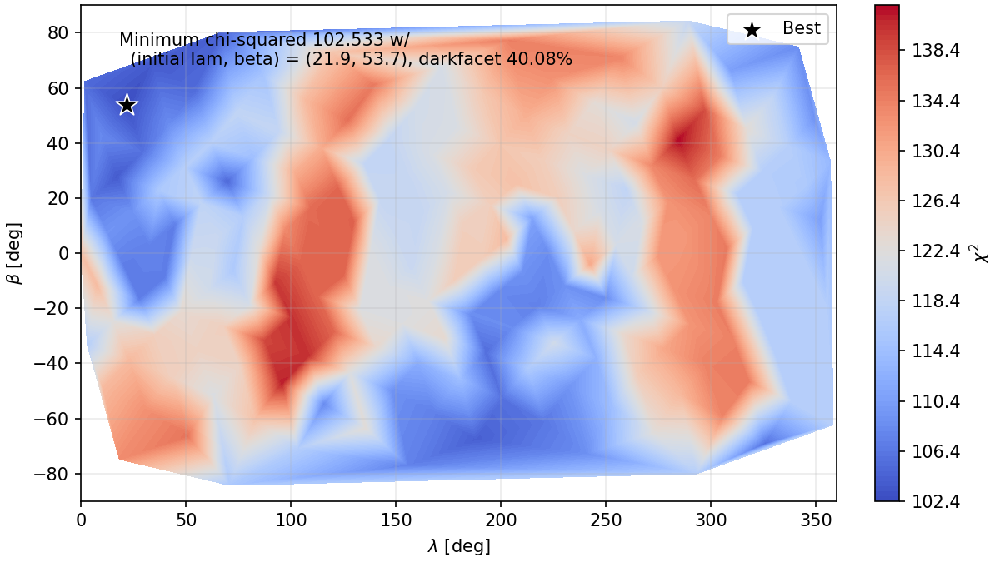
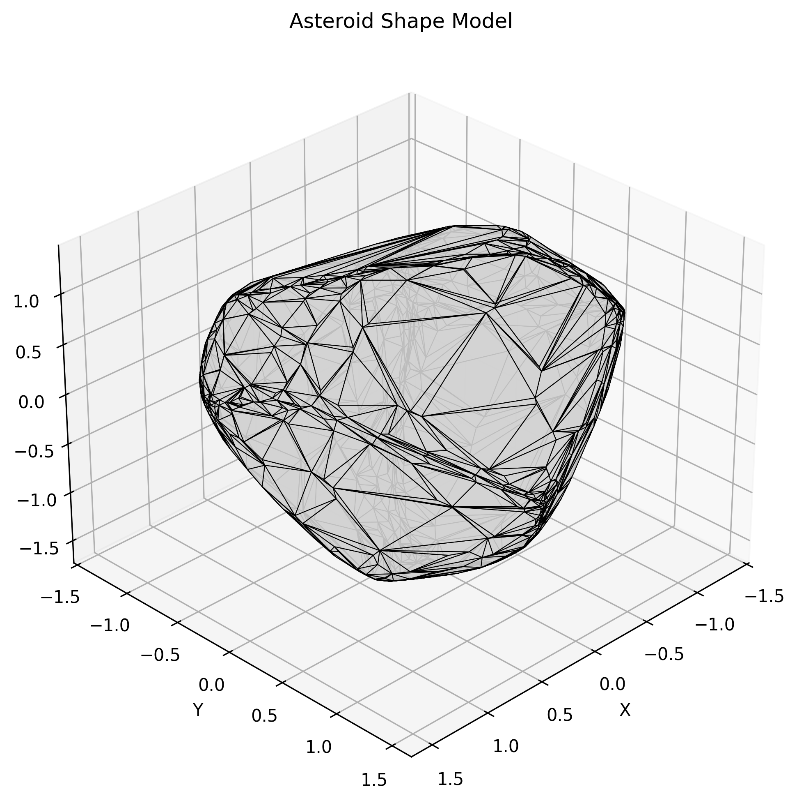

# PyMit Asteroid Modeler

PyMit wraps the DAMIT asteroid lightcurve inversion tools with a Python API and a local Streamlit browser UI. The Streamlit app is the fastest way to configure a run, launch period scans or pole-grid searches, inspect logs while the pipeline runs, and download generated outputs.


## Start With The Streamlit App

Install the Python dependencies, compile the DAMIT executables, then run the GUI from the repository root:

```bash
pip install -r requirements.txt
PYTHONPATH=src streamlit run apps/streamlit_app.py
```

The app supports:

- DAMIT plaintext lightcurve URLs
- Uploaded CSV files and native DAMIT/`convexinv` text files
- Optional DAMIT `period_scan` before convex inversion, with worker splitting
- Convex inversion parameter controls, including LSL scattering parameters `p1/c`, `p2/a`, `p3/d`, and `p4/k`
- Optional golden-spiral pole-grid search with initial or fitted pole maps
- Minkowski reconstruction controls
- Sky projection and synthetic lightcurve products for a selected Julian date
- Live pipeline logs, interactive 3D model display, phase-curve plots, folded residual plots, and download buttons

Sidebar values are saved to `.pymit_last_params.json` after a successful run and restored on the next app start.

## What PyMit Runs

The modeling pipeline wraps established DAMIT tools:

1. **`period_scan` (C, optional)**: searches a period range and selects the minimum chi-square period.
2. **`convexinv` (C)**: computes the Gaussian image of the asteroid from observed lightcurves.
3. **`minkowski` (Fortran)**: reconstructs 3D vertices and faces from the areas and normals.

PyMit adds lightcurve conversion, DAMIT URL downloads, parameter-file generation, threaded Streamlit execution, pole-grid scans, OBJ export, Matplotlib/Plotly visualizations, sky projections, and synthetic lightcurves.

## Prerequisites

- Python dependencies from `requirements.txt`
- Compiled DAMIT executables:
  - `damit/convexinv/convexinv`
  - `damit/convexinv/period_scan`
  - `damit/fortran/minkowski`
  - `damit/fortran/standardtri`

The DAMIT source can be downloaded from <https://damit.cuni.cz/projects/damit/files/version_0.2.1.tar.gz>.

Compile the bundled sources:

```bash
cd damit/convexinv
make

cd ../fortran
gfortran minkowski.f -o minkowski
gfortran standardtri.f -o standardtri
```

## Python Quick Start

```python
import pymit

modeler = pymit.AsteroidModeler(asteroid_name="A7753", output_dir="data")

modeler.load_lightcurves(
    "https://damit.cuni.cz/projects/damit/LightCurves/"
    "exportAllForAsteroid/7753/plaintext/A7753.lc.txt"
)

modeler.load_parameters(
    inversion_json={
        "initial_lambda": 269.0,
        "initial_lambda_fixed": 1,
        "initial_beta": 62.0,
        "initial_beta_fixed": 1,
        "initial_period": 33.0,
        "initial_period_fixed": 1,
        "phase_func_c": 0.1,
        "phase_func_c_fixed": 0,
        "phase_func_a": 0.5,
        "phase_func_a_fixed": 0,
        "phase_func_d": 0.1,
        "phase_func_d_fixed": 0,
        "phase_func_k": -1.05,
        "phase_func_k_fixed": 0,
    },
    conjgradinv_json={"number_of_iterations": 100},
)

# Optional: run period_scan first and let the best period seed convexinv.
vertices, faces = modeler.run_inversion(
    run_period_scan=True,
    period_scan_options={
        "period_start": 32.0,
        "period_end": 34.0,
        "period_interval_coefficient": 0.8,
    },
    period_scan_workers=1,
)

# Optional alternative: scan a golden-spiral grid of initial pole guesses.
# vertices, faces = modeler.run_pole_grid_scan(n=10, workers=1)

modeler.plot_lightcurves_results(save=True, show=False, max_curves=3)
modeler.plot_model(save=True, show=False)
modeler.plot_model_plotly(save=True, show=False)
modeler.plot_sky_projection(save=True, show=False, jd=2461169.0)
modeler.plot_synthetic_lightcurve(save=True, show=False, jd=2461169.0)
modeler.export_obj()

print(f"Generated {len(vertices)} vertices and {len(faces)} faces.")
```

## Output Examples






Common output files include:

- `<asteroid>_period_scan.txt`, `<asteroid>_period_scan.csv`, and `<asteroid>_period_scan.png`
- `<asteroid>_areas.txt` and `<asteroid>_lc_output.csv`
- `<asteroid>_pole_scan_results.csv`, `<asteroid>_pole_scan_best.json`, and pole-map PNGs
- `<asteroid>_model.png`, `<asteroid>_model.html`, and `<asteroid>.obj`
- `<asteroid>_lightcurves.html` and `<asteroid>_lightcurves_folded_residuals.png`
- `<asteroid>_sky_projection.csv` / `.png`
- `<asteroid>_synthetic_lightcurve.csv` / `.png`

## Documentation

- [Getting Started](docs/getting_started.md)
- [API Reference](docs/api_reference.md)
- [DAMIT Parameters Guide](docs/damit_parameters.md)
- [Scientific Method](docs/inversion_method.md)

## Notes

`p2`, `p3`, and `p4` fitting is off by default in the GUI. Enable those switches only when the lightcurves have enough phase-angle coverage; freeing the LSL scattering parameters on weakly constrained relative lightcurves can make `convexinv` fail with singular matrix errors.

PyMit raises `AsteroidModelError` when the underlying C or Fortran executables fail or return a non-zero exit code. Check the generated stdout logs and DAMIT parameter files when debugging a failed run.

## Licensing And Citations

The `damit` components used by this module are derived from the [Database of Asteroid Models from Inversion Techniques (DAMIT)](https://damit.cuni.cz/projects/damit/).

Except where otherwise stated by the authors, content is licensed under a [Creative Commons Attribution 4.0 International License](https://creativecommons.org/licenses/by/4.0/).

If you use this module and the underlying DAMIT executables for research, cite:

1. The original paper where a given model was published.
2. Ďurech et al. (2010), *DAMIT: a database of asteroid models*, A&A, 513, A46.
3. The DAMIT website: <https://damit.cuni.cz/projects/damit/>.
